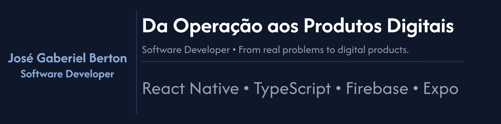

  

<h1 align="center">
# Hi there! 👋 I'm José Gabriel Berton
</h1>

### Software Developer

> **Building digital products from idea to production.**

I'm a Software Developer passionate about solving real-world problems through technology.

My journey combines software development, product thinking and business experience. I enjoy turning ideas into complete digital products, from architecture and implementation to deployment and continuous improvement.

📍 Florianópolis, SC - Brazil

---

# 🚀 Featured Projects

## 📱 Get & Use

**Peer-to-peer marketplace for renting everyday items.**

A complete marketplace built with React Native and Firebase, allowing users to rent, lend and manage items through a modern mobile experience.

### Highlights

- Authentication & User Profiles
- Marketplace Listings
- Reservation System
- Mercado Pago Integration
- Real-time Chat
- Push Notifications
- Image Upload
- Reviews & Ratings
- Google Play Deployment

**Tech Stack**

React Native • Expo • TypeScript • Firebase • Firestore • Cloud Functions • Storage • Mercado Pago

🌐 https://geteuse.com.br

📱 Google Play

https://play.google.com/store/apps/details?id=com.getanduseapp

---

## 📱 EasyRedes

**Mobile ERP for safety net installation companies.**

Application created to simplify field operations, customer management and inventory control.

### Main Features

- Customer Management
- Inventory Control
- Scheduling
- PDF Quotations
- Cloud Synchronization

**Tech Stack**

React Native • Expo • TypeScript • Firebase

---

## 🧠 TMT Digital

Digital version of the **Trail Making Test**, developed for healthcare professionals.

---

# 💻 Tech Stack

---

# 🎯 What I enjoy building

- Mobile Applications
- SaaS Platforms
- Marketplaces
- Business Automation
- Digital Products
- User-centered Solutions

---

# ✍️ Writing

### **From Operations to Digital Products**

I recently started sharing my career transition on LinkedIn, writing about software development, product thinking, leadership and the lessons learned while building digital products.

---

# 🌎 Connect with me

💼 **LinkedIn**

https://www.linkedin.com/in/jgberton

🌐 **Portfolio**

https://jgberton.web.app

🚀 **Get & Use**

https://geteuse.com.br

---

⭐ *Software is just the tool. Solving real problems is the goal.*
